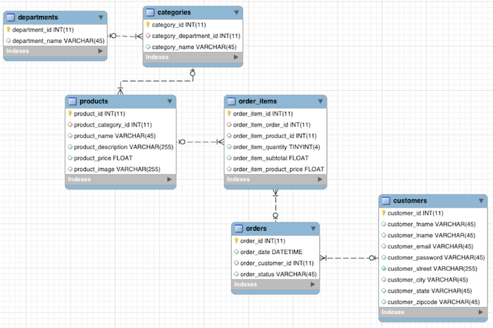

HIVE EXERCISES FOR CCA175 CLOUDERA PYSPARK DEVELOPER
=============================================
Taking into account this data model:



We will show the content of all the tables in the data model

**Categories**
```python
 categories = sc.textFile("/public/retail_db/categories")
 for i in categories.take(10):print(i)
... 
1,2,Football                                                                    
2,2,Soccer
3,2,Baseball & Softball
4,2,Basketball
5,2,Lacrosse
6,2,Tennis & Racquet
7,2,Hockey
8,2,More Sports
9,3,Cardio Equipment
10,3,Strength Training
```

**Customers**
```python
>>> customers = sc.textFile("/public/retail_db/customers")
>>> for i in customers.take(10):print(i)
... 
1,Richard,Hernandez,XXXXXXXXX,XXXXXXXXX,6303 Heather Plaza,Brownsville,TX,78521
2,Mary,Barrett,XXXXXXXXX,XXXXXXXXX,9526 Noble Embers Ridge,Littleton,CO,80126
3,Ann,Smith,XXXXXXXXX,XXXXXXXXX,3422 Blue Pioneer Bend,Caguas,PR,00725
4,Mary,Jones,XXXXXXXXX,XXXXXXXXX,8324 Little Common,San Marcos,CA,92069
5,Robert,Hudson,XXXXXXXXX,XXXXXXXXX,"10 Crystal River Mall ",Caguas,PR,00725
6,Mary,Smith,XXXXXXXXX,XXXXXXXXX,3151 Sleepy Quail Promenade,Passaic,NJ,07055
7,Melissa,Wilcox,XXXXXXXXX,XXXXXXXXX,9453 High Concession,Caguas,PR,00725
8,Megan,Smith,XXXXXXXXX,XXXXXXXXX,3047 Foggy Forest Plaza,Lawrence,MA,01841
9,Mary,Perez,XXXXXXXXX,XXXXXXXXX,3616 Quaking Street,Caguas,PR,00725
10,Melissa,Smith,XXXXXXXXX,XXXXXXXXX,8598 Harvest Beacon Plaza,Stafford,VA,22554
```

**Departments**
```python
>>> departments = sc.textFile("/public/retail_db/departments")
>>> for i in departments.take(10):print(i)
... 
2,Fitness
3,Footwear
4,Apparel
5,Golf
6,Outdoors
7,Fan Shop
>>> 

```

**Order Items**
```python
>>> orderItems = sc.textFile("/public/retail_db/order_items")
>>> for i in orderItems.take(10):print(i)
... 
1,1,957,1,299.98,299.98
2,2,1073,1,199.99,199.99
3,2,502,5,250.0,50.0
4,2,403,1,129.99,129.99
5,4,897,2,49.98,24.99
6,4,365,5,299.95,59.99
7,4,502,3,150.0,50.0
8,4,1014,4,199.92,49.98
9,5,957,1,299.98,299.98
10,5,365,5,299.95,59.99
>>> 
```

**Orders**
```python
>>> orders = sc.textFile("/public/retail_db/orders")
>>> for i in orders.take(10):print(i)
... 
1,2013-07-25 00:00:00.0,11599,CLOSED
2,2013-07-25 00:00:00.0,256,PENDING_PAYMENT
3,2013-07-25 00:00:00.0,12111,COMPLETE
4,2013-07-25 00:00:00.0,8827,CLOSED
5,2013-07-25 00:00:00.0,11318,COMPLETE
6,2013-07-25 00:00:00.0,7130,COMPLETE
7,2013-07-25 00:00:00.0,4530,COMPLETE
8,2013-07-25 00:00:00.0,2911,PROCESSING
9,2013-07-25 00:00:00.0,5657,PENDING_PAYMENT
10,2013-07-25 00:00:00.0,5648,PENDING_PAYMENT

```

**Products**
```python
>>> products = sc.textFile("/public/retail_db/products")
>>> for i in products.take(10):print(i)
... 
1,2,Quest Q64 10 FT. x 10 FT. Slant Leg Instant U,,59.98,http://images.acmesports.sports/Quest+Q64+10+FT.+x+10+FT.+Slant+Leg+Instant+Up+Canopy
2,2,Under Armour Men's Highlight MC Football Clea,,129.99,http://images.acmesports.sports/Under+Armour+Men%27s+Highlight+MC+Football+Cleat
3,2,Under Armour Men's Renegade D Mid Football Cl,,89.99,http://images.acmesports.sports/Under+Armour+Men%27s+Renegade+D+Mid+Football+Cleat
4,2,Under Armour Men's Renegade D Mid Football Cl,,89.99,http://images.acmesports.sports/Under+Armour+Men%27s+Renegade+D+Mid+Football+Cleat
5,2,Riddell Youth Revolution Speed Custom Footbal,,199.99,http://images.acmesports.sports/Riddell+Youth+Revolution+Speed+Custom+Football+Helmet
6,2,Jordan Men's VI Retro TD Football Cleat,,134.99,http://images.acmesports.sports/Jordan+Men%27s+VI+Retro+TD+Football+Cleat
7,2,Schutt Youth Recruit Hybrid Custom Football H,,99.99,http://images.acmesports.sports/Schutt+Youth+Recruit+Hybrid+Custom+Football+Helmet+2014
8,2,Nike Men's Vapor Carbon Elite TD Football Cle,,129.99,http://images.acmesports.sports/Nike+Men%27s+Vapor+Carbon+Elite+TD+Football+Cleat
9,2,Nike Adult Vapor Jet 3.0 Receiver Gloves,,50.0,http://images.acmesports.sports/Nike+Adult+Vapor+Jet+3.0+Receiver+Gloves
10,2,Under Armour Men's Highlight MC Football Clea,,129.99,http://images.acmesports.sports/Under+Armour+Men%27s+Highlight+MC+Football+Cleat
>>> 

```


## EXERCISES USING HIVE

**Exercise 1**
Create "order" and "order_items" table

Firstly, we have to database we will work with
```python
create database carlos_sanchez_retail_db_txt;
use carlos_sanchez_retail_db_txt;
```

Then, we create the order table:
```python
    create table orders(
        order_id int,
        order_date string, ---> date will be encoded as type string
        order_customer_id int,
        order_status string
    ) row format delimited files terminated by ","
    stored as textfile ;
```

And we load the data we have into the "orders" table
```python
load data local inpath '/data/retaild_db/orders' overwrite into table orders;
```

And the order_items table:
```python
    create table order_items(
        order_item_id int,
        order_item_order_id int,
        order_item_product_id int,
        order_item_quantity int, 
        order_item_subtotal float,
        order_item_product_price float
    ) row format delimited fields terminated by ","
    stored as textfile ;
```
And we load the data into the order_items table:
```python
load data local inpath '/data/retaild_db/order_items' overwrite into table order_items;

**Exercise 2**
Store file in ORC format:

```python
    create database carlos_sanchez_db_orc;
    use carlos_sanchez_db_orc;
```

Create order and orderItems with file format as ORC
```python
    create table orders(
      order_id int,
      order_date string,
      order_customer_id int,
      order_status string
    ) stored as orc ;

    create table order_items(
      order_item_id int,
      order_item_order_id int,
      order_item_product_id int,
      order_item_quantity int, 
      order_item_subtotal float,
      order_item_product_price float
    ) stored as orc;
```

Now, as we have already inserted the data in the txt database, we will execute the next command:
```python
insert into orders select * from carlos_sanchez_retail_db_txt.orders;
```
and we do the same with order_items table:

```python
insert into order_items select * from carlos_sanchez_retail_db_txt.order_items;
```

**Exercise 2**
Get the number of customers who do not have any corresponding orders (you want data which is in customers but not in orders)
```python
select count(1) from customers c left outer join orders o on o.order_customer_id = c.customer_id where o.order_customer_id is null;
30
```

**Exercise 3**
Get revenue per order.

To do it we have to group by order_id and then get the sum of the revenues.
```python
hive (default)> use carlos_sanchez_retail_db_txt;
hive (carlos_sanchez_retail_db_txt)> select * from order_items limit 10;
OK
1   1   957 1   299.98  299.98
2   2   1073    1   199.99  199.99
3   2   502 5   250.0   50.0
4   2   403 1   129.99  129.99
5   4   897 2   49.98   24.99
6   4   365 5   299.95  59.99
7   4   502 3   150.0   50.0
8   4   1014    4   199.92  49.98
9   5   957 1   299.98  299.98
10  5   365 5   299.95  59.99
Time taken: 0.671 seconds, Fetched: 10 row(s)
```

```python
hive (carlos_sanchez_retail_db_txt)> describe order_items;
OK
order_item_id           int                                         
order_item_order_id     int                                         
order_item_product_id   int                                         
order_item_quantity     int                                         
order_item_subtotal     float                                       
order_item_product_price    float    
```
As we can see, we have to use the order_items table:
```python
select oi.order_item_order_id,  sum(oi.order_item_subtotal) from order_items oi group by oi.order_item_order_id;
68280   399.9599914550781
68282   659.9000244140625
68283   1699.8000183105469
68284   549.9799957275391
68286   299.9800109863281
....
```

**Exercise 4**
Get the revenue per order and date having done more than 1000 dollars (COMPLETED and CLOSED revenues)

```python
use carlos_sanchez_retail_db_txt;

hive (carlos_sanchez_retail_db_txt)> select o.order_id, o.order_date,o.order_status, round(sum(oi.order_item_subtotal),2) order_revenue from orders o join order_items oi on o.order_id = oi.order_item_order_id where o.order_status in ('COMPLETED', 'CLOSED') group by o.order_id, o.order_date, o.order_status having sum(oi.order_item_subtotal)>=1000 distribute by o.order_date sort by o.order_date, daily_revenue desc limit 100 limit 10;
4   2013-07-25 00:00:00.0   CLOSED  1399.7
12  2013-07-25 00:00:00.0   CLOSED  2599.74
24  2013-07-25 00:00:00.0   CLOSED  1659.94
57  2013-07-25 00:00:00.0   CLOSED  1275.8
61  2013-07-25 00:00:00.0   CLOSED  1279.84
62  2013-07-25 00:00:00.0   CLOSED  2299.88
101 2013-07-25 00:00:00.0   CLOSED  1799.88
116 2013-07-26 00:00:00.0   CLOSED  1591.82
133 2013-07-26 00:00:00.0   CLOSED  1279.82
213 2013-07-26 00:00:00.0   CLOSED  1399.86
Time taken: 32.438 seconds, Fetched: 10 row(s)

```
